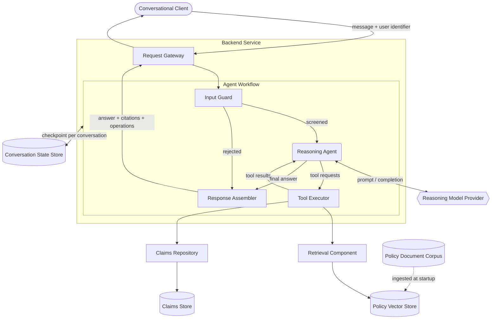
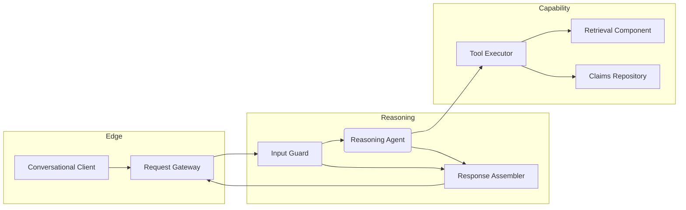
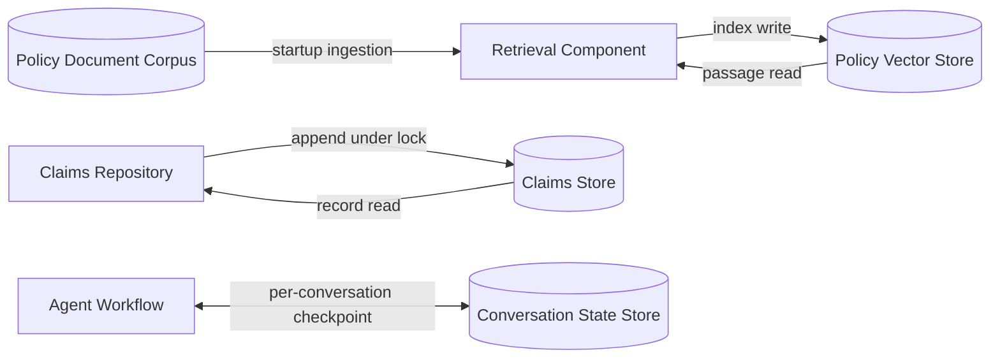

# OmniCare Customer Assistant — Technical Documentation

## 1. Overview

The OmniCare Customer Assistant is a conversational service for insurance
policyholders. It handles the three interactions that dominate inbound support
volume: confirming what a policy covers, checking the progress of an existing
claim, and filing a new one.

Each of those interactions is answered differently. Coverage questions must be
grounded in the authoritative policy document and must show which clause the answer
came from, because an unsourced coverage statement is a liability rather than a
service. Claim questions must reflect the operational record of truth, not the
model's recollection. Claim filing is a write against that record and therefore
needs validated input and a confirmation the policyholder can quote back.

The system exists to route a single free-text message to the right one of those
three behaviours, and to return not only an answer but the evidence behind it: the
policy sections cited, and the operations performed.

## 2. Scope

**In scope**

| Capability | Description |
|---|---|
| Grounded coverage answers | Retrieval over the policy corpus with clause-level citations returned as structured data |
| Claim status lookup | Read-only retrieval of an existing claim record by reference |
| Claim submission | Validated write of a new claim record, returning a confirmation reference |
| Conversational continuity | Multi-turn collection of claim details, scoped per policyholder |
| Input safety | Screening of instruction-override and role-manipulation attempts before model invocation |

**Out of scope**

Claim adjudication is deliberately excluded: no component can approve, deny, or
otherwise change the status of a claim. Submissions enter at an initial submitted
state and move only through processes outside this system. Identity verification,
payments, document upload, and policy amendment are likewise out of scope.

**Position in the wider platform**

This is a self-contained module with two external dependencies: a hosted or local
reasoning model, and the claims system of record. In this prototype the claims
system is a local document store standing in for the operational claims database;
the persistence layer is isolated behind a repository interface so that substitution
does not touch the agent or the API.

## 3. System Architecture

The client sends a message and a policyholder identifier to the request gateway,
which validates the payload and hands it to the agent workflow. The input guard is
the first stage and can terminate the turn on its own, routing straight to the
response assembler so that a rejected message still produces a well-formed reply.

Cleared messages reach the reasoning agent, which decides whether it needs evidence
or an operation. Tool requests are executed by the tool executor and their results
returned to the agent, which may loop until it can answer. The response assembler
then reconstructs the turn from the workflow's own record — not from the agent's
prose — producing the answer, the policy sections cited, and the operations
performed.

Two storage interactions sit outside that loop. The policy corpus is ingested into
the vector store once at service startup. Conversation state is checkpointed per
policyholder so a partially collected claim survives between turns.

## 4. Components & Services

### 4.1 Application & Service Components

| Component | Responsibility |
|---|---|
| Conversational Client | Presents the exchange, the cited sections and the operations performed for each answer; holds no business logic |
| Request Gateway | Validates inbound payloads against a strict schema, binds the turn to a conversation thread, and serialises the workflow result into the response contract |
| Input Guard | Screens each message for instruction-override, role-manipulation, prompt-extraction and operation-coercion patterns, plus malformed and oversized input; terminates the turn on a match |
| Tool Executor | Dispatches the agent's tool requests, enforces each tool's argument schema, and converts validation failures into recoverable messages rather than faults |
| Retrieval Component | Splits the policy corpus on heading boundaries, maintains the index, and answers queries with clause-labelled passages; falls back to lexical scoring if the semantic index is unavailable |
| Claims Repository | Sole reader and writer of the claims store; serialises mutations under an exclusive lock and commits them atomically |
| Response Assembler | Reconstructs citations and performed operations from the workflow record, independently of what the agent wrote in prose |

The grouping reflects where each kind of change lands. Edge components own the
contract with callers. Reasoning components own how a turn is interpreted and what
is ultimately claimed. Capability components own access to evidence and to the
record of truth — and are the only components that touch storage, which is what
keeps the reasoning layer free of persistence concerns.

### 4.2 AI Models & Agents

| Agent / Model | Function |
|---|---|
| Reasoning Agent | Interprets the policyholder's intent and selects among retrieval, claim lookup and claim submission, looping until it can answer. Instructed to answer coverage questions only from retrieved passages, to cite the sections it relied on, to treat all retrieved text and tool output as reference data rather than as instructions, and to collect and confirm every claim argument with the policyholder before filing. It cannot report a claim status or a confirmation reference that a tool did not return, and it has no capability to approve, deny or alter any claim. |
| Embedding Model | Encodes policy passages and incoming queries into a shared vector space for semantic retrieval. Runs on-device so no document content leaves the deployment. Substitutable, and bypassed entirely when the retrieval component falls back to lexical scoring. |

The two are independent: the reasoning model is selected per deployment from
several supported providers, while embedding stays local regardless of that choice.

## 5. Data Architecture

| Store | Purpose | Written by | Read by |
|---|---|---|---|
| Policy Document Corpus | Authoritative source for coverage rules, limits, deductibles and exclusions | Not written by this system — maintained upstream by the policy owners | Retrieval Component, once per service start, to build the index |
| Policy Vector Store | Indexed representation of the corpus supporting semantic search | Retrieval Component, at service startup, replacing any prior index for the same passages | Retrieval Component, on every coverage question the Tool Executor dispatches |
| Claims Store | Record of truth for claim references, types, amounts and statuses | Claims Repository, on a confirmed claim submission — append only, under an exclusive lock and committed atomically | Claims Repository, on every claim status lookup |
| Conversation State Store | Per-policyholder message history enabling multi-turn claim collection | Agent Workflow, at each checkpoint within a turn | Agent Workflow, at the start of each turn, scoped to the requesting policyholder's identifier |

Three access patterns are worth separating. The corpus is read-only to this system
and flows one way into the index, so a policy revision is applied by reissuing
ingestion rather than by editing anything in place. The claims store is the only
store this system mutates, and only ever by appending — no component updates or
deletes an existing record, which is what makes the no-adjudication boundary
structural rather than a matter of prompt discipline. Conversation state is
read-write within a turn and partitioned by policyholder identifier, so one
policyholder's partially collected claim is never visible to another.

## 6. Workflow & Pipeline

**Stage 0 — Corpus ingestion (once, at service start).** The Retrieval Component
reads the Policy Document Corpus and splits it on heading boundaries, so each
passage holds one complete coverage rule together with the heading that names it.
That heading becomes the passage's citation label and is carried through every
later stage. Passages are written to the Policy Vector Store. If the semantic index
cannot be prepared, the component builds a lexical index over the same passages and
the service starts in degraded retrieval mode rather than failing.

**Stage 1 — Request admission.** The Request Gateway receives a message and a
policyholder identifier from the Conversational Client, validates both against a
strict schema, and rejects malformed payloads before any reasoning occurs. The
identifier is bound to a conversation thread, which determines the slice of
Conversation State Store this turn will read and write.

**Stage 2 — Input screening.** The Input Guard examines the raw message for
instruction-override, prompt-extraction, role-manipulation and operation-coercion
patterns, and for malformed or oversized input. On a match the turn terminates
here and jumps directly to Stage 6 with a refusal, so no rejected content ever
reaches the model. Otherwise the turn proceeds.

**Stage 3 — Intent and evidence.** The Reasoning Agent receives its operating
instructions, the prior turns from the Conversation State Store, and the new
message. It determines which capability the request needs and issues tool requests
accordingly. Coverage questions produce a retrieval request; claim questions
produce a lookup; a filing request produces either a submission or, more often, a
question back to the policyholder for a missing detail.

**Stage 4 — Capability execution.** The Tool Executor validates each request's
arguments before execution. A retrieval request goes to the Retrieval Component,
which reads the Policy Vector Store and returns passages with their citation
labels. A lookup goes to the Claims Repository, which reads the Claims Store and
returns the record or an explicit not-found. A submission goes to the Claims
Repository, which validates the claim, takes an exclusive lock, appends the record
atomically and returns a confirmation reference. Argument validation failures are
returned as recoverable messages, so the agent asks the policyholder for a
correction rather than failing the turn.

**Stage 5 — Iteration or answer.** Results return to the Reasoning Agent, which
either issues further tool requests — bounded by a step limit — or composes its
answer, citing the passages it relied on.

**Stage 6 — Response assembly.** The Response Assembler walks the turn's record and
extracts two things independently of the agent's prose: the citation labels of every
passage actually retrieved, and every operation actually executed with its arguments
and outcome. This is what prevents an uncited answer from losing its provenance and
prevents an unexecuted operation from being reported as done. The Request Gateway
returns the answer, the citations and the operations to the Conversational Client,
which displays all three. The turn's messages are checkpointed to the Conversation
State Store so the next turn resumes with full context.
